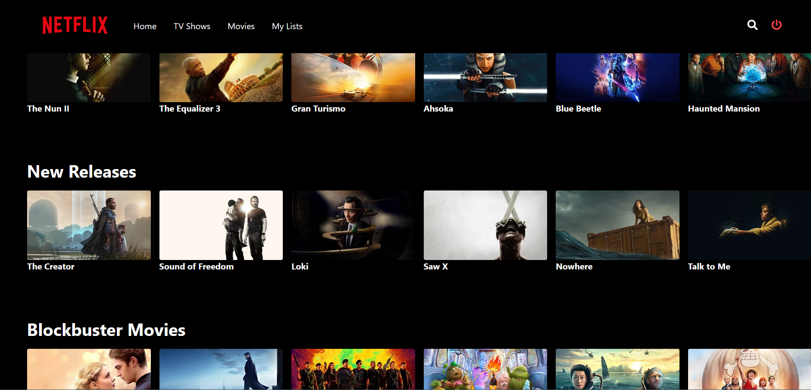

# MovieFlix - Fullstack Web App

MovieFlix is a fullstack web app that leverages TMDB API for movie data, ExpressJS for backend, Firebase for authentication, and React for frontend.

## Technologies Used

- [TMDB API](https://www.themoviedb.org/documentation/api): Provides movie data and information.
- [ExpressJS](https://expressjs.com/): Backend framework for handling API requests and routes.
- [Firebase](https://firebase.google.com/): Authentication and database management.
- [React](https://reactjs.org/): Frontend library for building user interfaces.

## Features

- Browse popular movies, upcoming releases, and top-rated films.
- Search for specific movies and view detailed information.
- User authentication and signup functionality using Firebase.
- Allow users to create a watchlist and manage their favorite movies.
- Customized user experience with personalized movie recommendations.

## Installation

1. Clone the repository: `git clone https://github.com/duplixx/Netflix_FullStack/`
2. Install backend dependencies: `cd backend && npm install`
3. Install frontend dependencies: `cd frontend && npm install`

## Configuration

1. Rename `.env.example` to `.env` and add your TMDB API key.
2. Set up your Firebase project and add Firebase credentials to `.env`.

## Usage

1. Start the backend server: `cd backend && npm start`
2. Start the frontend server: `cd frontend && npm start`
3. Access the web app at `http://localhost:3000`.

## Contributing

Contributions are welcome! Please fork the repository and create a pull request.

## License

This project is licensed under the [MIT License](LICENSE).

## Credits

- Movie data provided by [TMDB](https://www.themoviedb.org/).
- Firebase authentication and database services.
